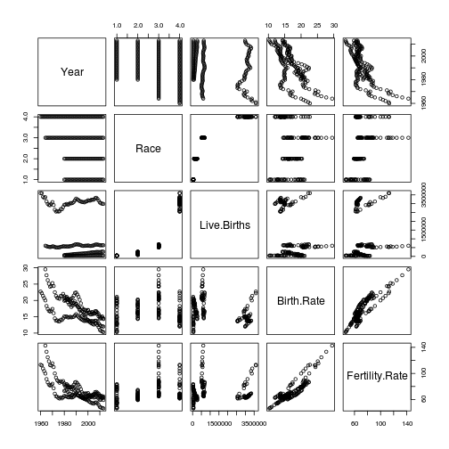

U.S. Birth and Fertility Rates
========================================================
author: Allen Lau 
date: December 3, 2016
autosize: true

Summary
========================================================

The birth and fertility rates data obtained through the [CDC](https://www.cdc.gov/) and [DATA.GOV](https://www.data.gov/) provide a glimpse into the contribution of births by mothers of differnt races and age groups in the United States for the past half to three-quarter century. Using the [Natality_Birth_Fertility_Browser](https://allen8r.shinyapps.io/Natality_Birth_Fertility_Browser/) at https://allen8r.shinyapps.io/Natality_Birth_Fertility_Browser/ one can clearly see the birth rates trending downwards through the years for all races and age groups. There were a few exceptional periods of rapid increase in the birth and fertility rates. These growth periods seem to coincide with periods of economic expansion in the United States during the mid to late 20th and early 21st centuries. However, in spite of these short-term upticks, the general trend seem to indicate that birth and fertility rates will continue to fall as time passes.


Sample Data
========================================================

```
   Year                   Race Live.Births Birth.Rate Fertility.Rate
1  1980 Asian/Pacific Islander       74355       19.9           73.2
2  1981 Asian/Pacific Islander       84553       20.1           73.7
3  1982 Asian/Pacific Islander       93193       20.3           74.8
4  1983 Asian/Pacific Islander       95713       19.5           71.7
5  1984 Asian/Pacific Islander       98926       18.8           69.2
6  1985 Asian/Pacific Islander      104606       18.7           68.4
7  1986 Asian/Pacific Islander      107797       18.0           66.0
8  1987 Asian/Pacific Islander      116560       18.4           67.1
9  1988 Asian/Pacific Islander      129035       19.2           70.2
10 1989 Asian/Pacific Islander      133075       18.7           68.2
11 1990 Asian/Pacific Islander      141635       19.0           69.6
12 1991 Asian/Pacific Islander      145372       18.3           67.1
13 1992 Asian/Pacific Islander      150250       17.9           66.1
14 1993 Asian/Pacific Islander      152800       17.3           64.3
15 1994 Asian/Pacific Islander      157632       17.1           63.9
16 1995 Asian/Pacific Islander      160287       16.7           62.6
17 1996 Asian/Pacific Islander      165776       16.5           62.3
18 1997 Asian/Pacific Islander      169769       16.2           61.3
19 1998 Asian/Pacific Islander      172652       15.9           60.1
20 1999 Asian/Pacific Islander      180776       15.9           60.9
21 2000 Asian/Pacific Islander      200543       17.1           65.8
22 2001 Asian/Pacific Islander      200279       16.1           62.5
23 2002 Asian/Pacific Islander      210907       16.3           63.3
24 2003 Asian/Pacific Islander      221203       16.4           64.2
25 2004 Asian/Pacific Islander      229123       16.4           64.5
```

Trend in Data
========================================================


See [Natality_Birth_Fertility_Browser](https://allen8r.shinyapps.io/Natality_Birth_Fertility_Browser/) application at https://allen8r.shinyapps.io/Natality_Birth_Fertility_Browser/ for in depth details of the birth, fertility, data broken down by race and age groups.


Sources
========================================================
- [NCHS - Birth Rates, by Age of Mother: United States, 1940-2013](https://catalog.data.gov/dataset/birth-rates-by-age-of-mother-united-states-1940-2013)

- [NCHS - Births, Birth Rates, and Fertility Rates, by Race of Mother: United States, 1960-2013](https://catalog.data.gov/dataset/births-birth-rates-and-fertility-rates-by-race-of-mother-united-states-1960-2013)
    
- [CDC - Center for Disease Control and Prevention](https://www.cdc.gov/)
    
- [DATA.GOV - The home of the U.S. Government's open data](https://www.data.gov/)
